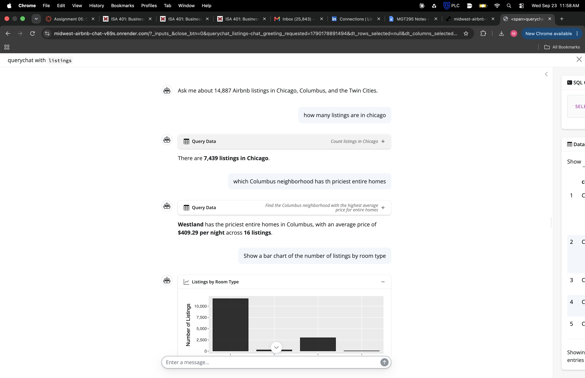
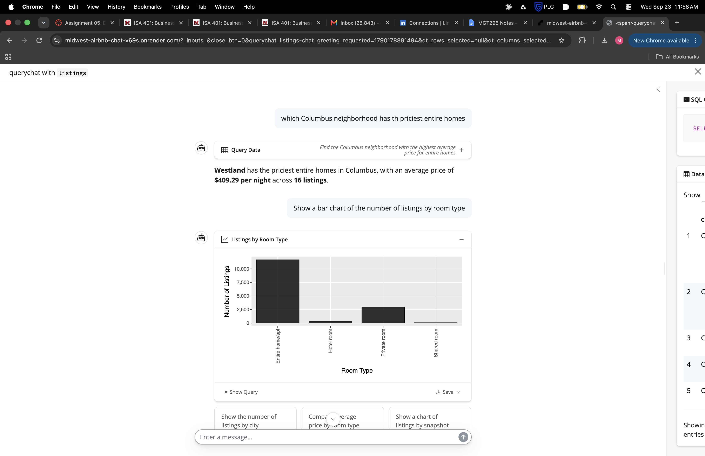
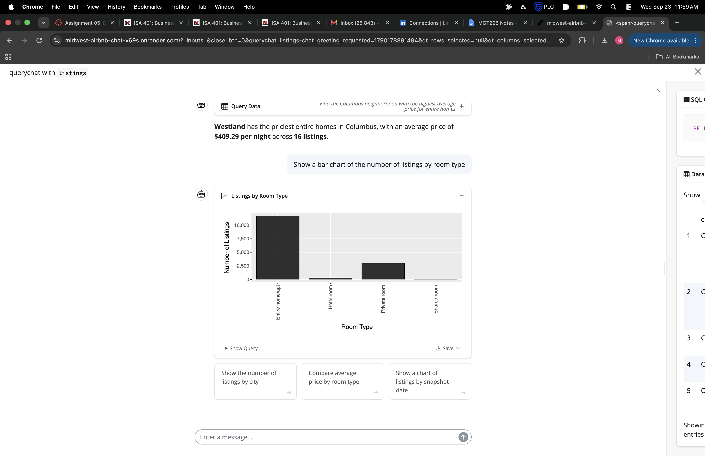

# ISA 401 Midwest Airbnb Chat

**Ask a question in plain English, get the SQL and a table back**

A [querychat](https://github.com/posit-dev/querychat) app built in ISA 401 (Miami University) on 14,887 Airbnb listings from Chicago, Columbus, and the Twin Cities. Adapted from the Class 06 Job Scout Chat template, deployed to [Render](https://render.com) from GitHub.

**Live app:** https://midwest-airbnb-chat-v69s.onrender.com

---

## What is this app?

The app connects to a SQLite database (`data/midwest_airbnb.db`), hands the `listings` table to querychat, and lets an LLM translate your question into SQL. Every answer shows the query it ran, so you can check the logic and reuse the SQL yourself.

**Example queries:**
- "How many listings are in Chicago?"
- "Which Columbus neighbourhood has the priciest entire homes?"
- "Do superhosts charge more per night than other hosts? Show it as a bar chart."

---

## Dataset Information

**Dataset:** `listings` table in `data/midwest_airbnb.db` (14,887 rows, 29 columns)

**Source:** Inside Airbnb, July 2026 snapshots for Chicago (2026-07-20), Columbus (2026-07-23), and the Twin Cities (2026-07-21)

**Data dictionary:** `data/data_desc.md`

**Query rules for the LLM:** `data/extra_instructions.md`

### Key Fields

| Field | Description |
|-------|-------------|
| `name` | Listing title as it appeared on Airbnb |
| `city` | `Chicago`, `Columbus`, or `Twin Cities` |
| `neighbourhood` | Neighbourhood name within the city |
| `price` | Price per night, in US dollars |
| `room_type` | Type of listing (e.g. entire home/apt, private room) |
| `host_is_superhost` | `t` if the host is a superhost, `f` otherwise (some `NA`) |

---

## Required Secret

The app calls OpenAI (`gpt-5.6-luna`, reasoning off) through [ellmer](https://ellmer.tidyverse.org/), so it needs one environment variable:

```bash
export OPENAI_API_KEY="your-api-key-here"
```

On Render, add it under **Environment** as `OPENAI_API_KEY`. Never commit the key; `.Renviron` is listed in `.gitignore` for that reason.

---

## Running Locally

**With R:**

```r
# from inside apps/midwest_airbnb_chat/
shiny::runApp(".", port = 7860)
```

**With Docker:**

```bash
docker build -t midwest_airbnb_chat .
docker run --rm -p 7860:7860 -e OPENAI_API_KEY=$OPENAI_API_KEY midwest_airbnb_chat
```

Then open http://localhost:7860.

---

## Technology Stack

- **[Shiny](https://shiny.posit.co/)** - Web application framework for R
- **[querychat](https://github.com/posit-dev/querychat)** - Natural language data querying
- **[ellmer](https://ellmer.tidyverse.org/)** - LLM client for R
- **[RSQLite](https://rsqlite.r-dbi.org/)** - SQLite driver for R

---

## Course Information

This application was developed for **ISA 401** at **Miami University**, built by Matt Easton.

---

## Example Questions

**How many listings are in Chicago?**



**Which Columbus neighbourhood has the priciest entire homes?**



**Show a bar chart of the number of listings by room type.**


